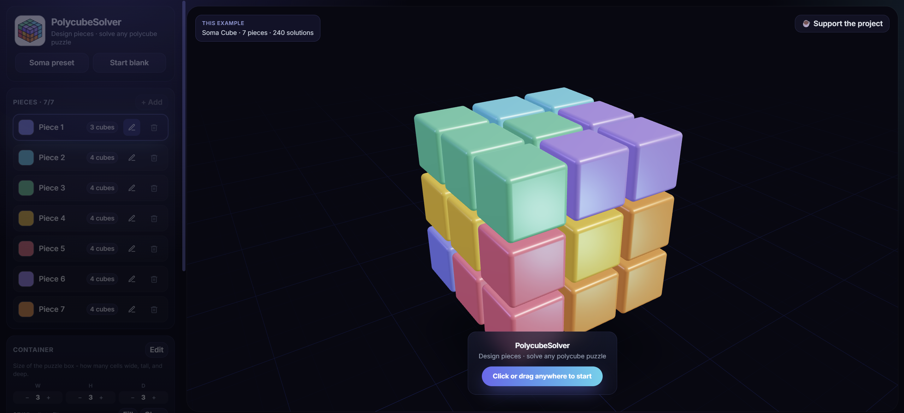
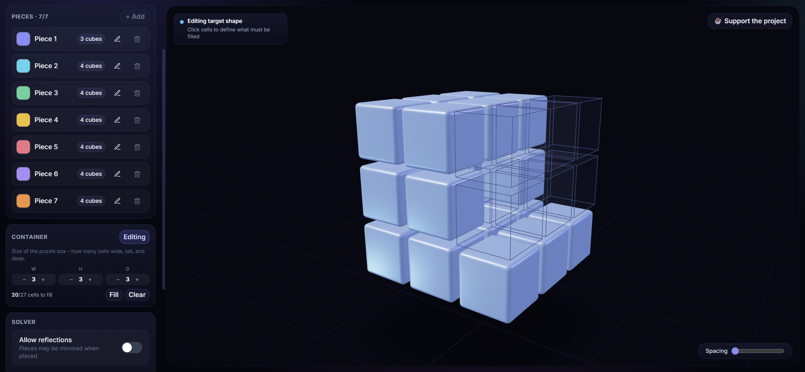
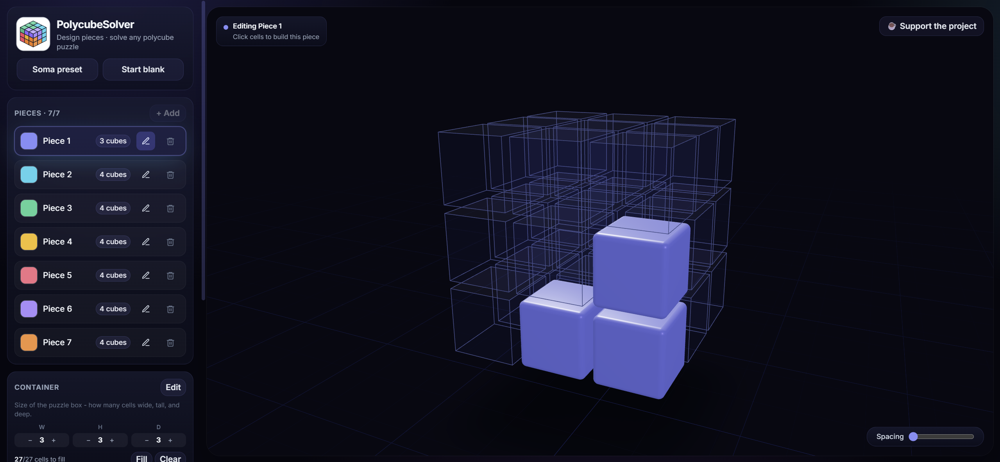
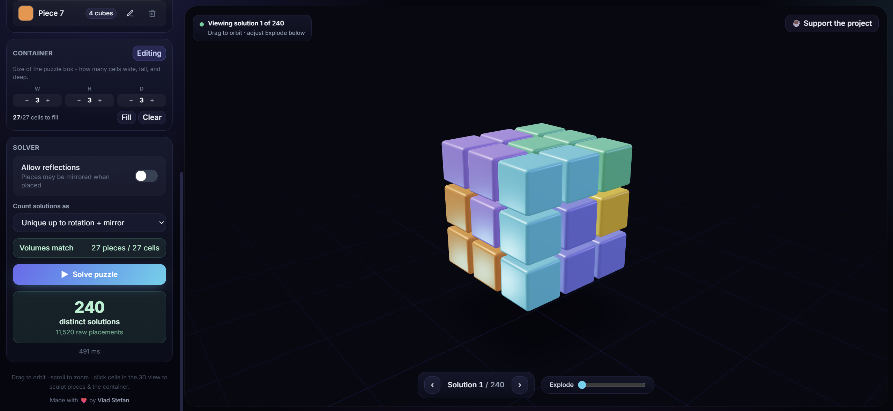

# PolycubeSolver - Soma Cube Solver & 3D Polycube Puzzle Solver

**PolycubeSolver** is a free browser app to design polycube pieces and **solve Soma Cube-style packing puzzles** in 3D. Build up to 7 pieces, sculpt any target shape, and run an exact-cover **polycube solver** with live counts and an interactive solution viewer.

<p align="center">
  <a href="https://stefanvlad0.github.io/PolycubeSolver/">
    <strong>👉 Try the live Soma & polycube solver</strong>
  </a>
</p>

<p align="center">
  <sub><a href="https://stefanvlad0.github.io/PolycubeSolver/">stefanvlad0.github.io/PolycubeSolver</a></sub>
  &nbsp;·&nbsp;
  <sub><a href="https://github.com/StefanVlad0/PolycubeSolver/issues">Report an issue</a></sub>
</p>



## Features

- **Soma Cube preset** - classic 7-piece puzzle, 240 distinct solutions (rotation + mirror).
- **3D polycube editor** - click cells to build pieces and irregular target shapes.
- **Polycube solver** - Dancing Links (Algorithm X) in a Web Worker; raw or symmetry-deduped counts.
- **Solution browser** - step through layouts, explode view, orbit and zoom.
- **Up to 7 pieces** - custom names and colors; reflections optional.
- **No install** - runs entirely in the browser.

## Screenshots

### Define the target shape



### Edit polycube pieces



### Browse Soma solutions



## Getting started

```bash
git clone https://github.com/StefanVlad0/PolycubeSolver.git
cd PolycubeSolver
npm install
npm run dev
```

Open [http://localhost:5173](http://localhost:5173) (or the URL Vite prints).

```bash
npm run build    # production build to dist/
npm run preview  # preview the production build
```

## How the Soma / polycube solver works

Each piece and the container are sets of unit cells on a 3D grid. The solver generates all orientations (24 rotations, or 48 with reflections) and valid placements, then encodes the puzzle as an **exact cover** problem solved with **Knuth's Dancing Links**.

For **Soma Cube** counting, solutions are canonicalized under container symmetries so mirror-equivalent packings collapse to one - giving the classic **240** distinct solutions.

```bash
npx tsx scripts/verify.ts
# Soma 3x3x3 -> raw=11520, unique-rotations=480, unique-rot+reflect=240
```

## Tech stack

React · TypeScript · Vite · Three.js (`@react-three/fiber`, `drei`) · Zustand · Tailwind CSS · Web Workers

## Author

Made by **[Vlad Stefan](https://github.com/StefanVlad0)** · [Support the project](https://buymeacoffee.com/vladstefans)

## License

[MIT](LICENSE)

## Contributing

See [CONTRIBUTING.md](CONTRIBUTING.md). Bug reports and pull requests are welcome.

## Changelog

See [CHANGELOG.md](CHANGELOG.md).
